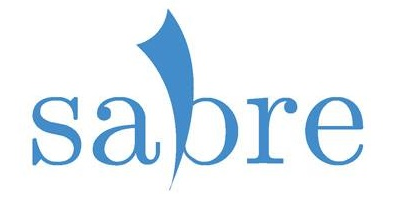

# 

## Introduction

The SabreTools project started as a desktop port of some core features of Wizard of DATz Redux, but it has since grown into a fully-featured DAT management tool. Below is a brief description of the features available in the suite. For more information about each feature, see the help text in each of the programs. For more information about the parent project, see [here](https://github.com/SabreTools/wizzardRedux).

> "tbh...  i have no real idea what sabretools is xD. my best guess  some prehistoric sort of swiss army knife" - **Executer**

## Features

For the most complete set of information, see the [README.1ST](https://raw.githubusercontent.com/SabreTools/SabreTools/master/SabreTools.Library/README.1ST) file. Currently, the SabreTools suite consists of the following programs:

### SabreTools / SabreTools.Library

As the core of the SabreTools suite, C# library provides nearly all of the functionality, while the main executable acts as a reference implementation. Below is a list of features included in the library and exposed though the executable:

* **Dir2DAT / DATFromDir** - Create a DAT from a file, folder, or mix of both
	* Archives and files can be filtered selectively
	* Archives and CHDs can be treated like files, that is, it will get an external hash only
	* Multiple input archive formats are supported: 7zip, GZip, RAR, TAR, and ZIP/ZIP64
	* Multiple hashing algorithms available, up to SHA-512
	* Created DATs can be output in multiple formats at once, including ClrMamePro, Logiqx XML, and RomCenter
	* All DAT fields can be set for the output
	* Files with copier headers can be checked for additional hashes
* **DAT Conversion** - Convert DATs between numerous formats, including standards such as ClrMamePro, Logiqx XML, and RomCenter
	* Converted DATs can be output in multiple formats at once
	* Filtering can be done on all DATs based on criteria such as item type, sizes, hashes, and names
	* Input DATs can optionally be merged and diffed with each other
	* All DAT fields can be updated during the conversion
* **DAT Splitting** - Split DATs based on multiple different criteria
	* Split by user-defined extensions into two DATs
	* Split by best-available hash, e.g. SHA-1
	* Split a SuperDAT on the lowest available directory level
	* Split by DAT item types
* **DAT Statistics** - Get statistics on a DAT or folder of DATs
	* Includes items such as rom and game counts
	* Includes the total uncompressed size of all items
	* Optionally includes statistics on individual DATs in a folder
	* Reports can be output in standard text, CSV, and/or HTML formats
* **Extract and Restore Copier Headers** - Extract and store or restore from DB copier headers
	* Supports copier headers from the following systems:
		* Atari 7800
		* Atari Lynx
		* Commodore 64 PSID music
		* NEC PC-Engine / TurboGrafx 16
		* Nintendo Famicom Disk System
		* Nintendo Entertainment System / Famicom
		* Super Nintendo Entertainment System / Super Famicom
		* Super Nintendo Entertainment System / Super Famicom SPC music
	* Stores the header information linked to unheadered hash
* **Rebuild From DAT** - Act as a simple rebuilder for files
	* Two options for rebuild origin: standard folder and Romba depot
	* Multiple output formats: unarchived, TAR, TorrentZip, 7zip, XZ, TorrentGZ
	* Can rebuild from multiple DATs at the same time
	* Cross-check with multiple hashing algorithms, up to SHA-512
	* Can output a fixdat based on the rebuilt files
	* CHDs can be rebuilt either to folders or to TorrentGZ archives
* **Verify From DAT** - Act as a simple verifier for files
	* Two options for verification target: standard folder and Romba depot
	* Exact verification and hash-only verification both available
	* Can verify from multiple DATs at the same time
	* Cross-check with mutliple hashing algorithms, up to SHA-512
	* CHDs can be treated like files

This tool has a comprehensive list of command line parameters that can be used to do the above and much more.

### RombaSharp

An in-progress tool that will try to act as a C# port of the Go-based [Romba](https://github.com/uwedeportivo/romba/) program. All features that are not already a part of SabreTools will be attempted to be added to this program. It is NOT ready for use yet. For any inquiries into the full features of this tool, please contact the project.

## Builds

In the most technical sense, the best way to get the newest version is to build it yourself. There's no guarantee that I will release intermediate builds based on incremental code updates. Combined with the fact that I don't know how to set up a continuous build system, we get an odd situation for those users who want the bleeding edge releases. For the time being, you can find all test and intermediate builds at [this link](https://mega.nz/#F!8JUhWZxT!h4DnCsgcBsMH3RRDKv27CA).

### Some Things to Note

I have to say these because I know how some users are.

1. These builds have no guarantee of working for all features. For best experiences, please use the latest stable build.
2. These builds may contain features that will be replaced or removed in the future. Do NOT take a dependency on any flags or naming conventions that you see.
3. The names of the builds generally have to do with what each new change tests. Do NOT ask for names of these to be changed; they are named exactly how they will stay, no matter how odd or stupid it is.
4. Not all versions will be built each time. This means that some test builds and prereleases will ONLY have a Mono x64 build or a Debug x64 build. Unless there is a specific need to test one of these and you have no way of building yourself, please do not request alternate versions of these.
5. No, I won't be hosting them on another hoster. MEGA does its job here and that's all that is needed. Yes, I know that some multiple uploaders include MEGA. No, I don't care. Sorry.

The day that a continuous build system is set up (read: never), these links will be archived, possibly on a third party host instead of relying on MEGA.

## Licensing

The preceding programs use, in part or in whole, code, libraries, and/or applications from the [7-zip project](http://www.7-zip.org). 7-zip is licensed under the GNU LGPL.

The preceding programs use, in part or in whole, code, libraries, and/or applications from [DotNetSharp](https://dotnetzip.codeplex.com). DotNetSharp is licensed under the Microsoft Public License of October 2006.

All other external code is marked as such within the source and correctly attributed to the site and/or person(s) that originally wrote the code.

All code written by project members is licensed under GPL v3. See LICENSE for more details.

## Contributions

Any feature suggestions or code contributions are accepted. Please take the time to look over the existing code to see proper coding and documentation patterns.

Contributors are attributed in the code and in the README.